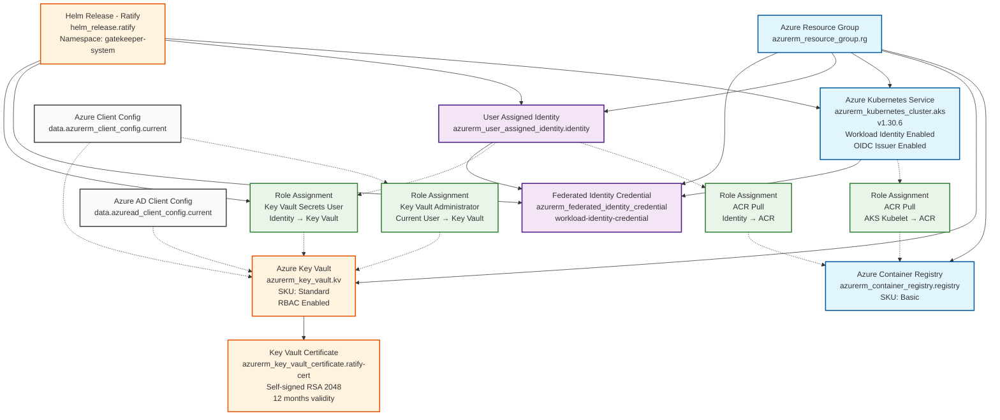

# Infrastructure Diagram

This Mermaid diagram shows the Azure resources created by this Terraform configuration for a signed container images verification demo.

## Resource Summary

### Core Infrastructure
- **Resource Group**: Container for all resources
- **Azure Container Registry (ACR)**: Stores container images
- **Azure Kubernetes Service (AKS)**: Kubernetes cluster with workload identity
- **Azure Key Vault**: Stores certificates and secrets

### Identity & Security
- **User Assigned Identity**: Managed identity for workload identity authentication
- **Federated Identity Credential**: Links AKS service account to managed identity
- **Key Vault Certificate**: Self-signed certificate for Ratify (container image verification)

### RBAC Assignments
- **ACR Pull**: Allows identity and AKS to pull images from registry
- **Key Vault Secrets User**: Allows identity to read secrets from Key Vault
- **Key Vault Administrator**: Gives current user admin access to Key Vault

### Application
- **Helm Release (Ratify)**: Container image verification tool deployed to AKS

### Data Sources
- **Azure Client Config**: Current Azure client configuration
- **Azure AD Client Config**: Current Azure AD client configuration

This infrastructure supports a container image signing and verification workflow using Ratify in an AKS cluster with workload identity authentication to Azure Key Vault for certificate access.
